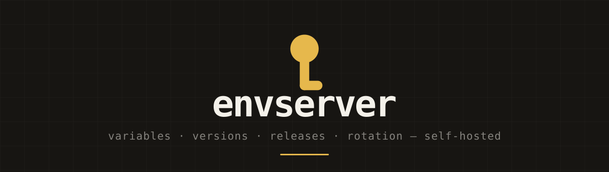

<p align="center">
  
</p>

<p align="center">
  
  
  
  
  
</p>

<p align="center">
  Central management of environment and security variables, with version
  history, variables you share across multiple projects, and a CLI that
  hands your servers a fresh <code>.env</code> during a deploy.
</p>

<p align="center">
  <a href="#how-it-fits-together">How it fits together</a> ·
  <a href="#encryption">Encryption</a> ·
  <a href="#access">Access</a> ·
  <a href="#getting-started">Getting started</a> ·
  <a href="#the-cli">The CLI</a> ·
  <a href="#tests">Tests</a>
</p>

## How it fits together

```
Team ──< Project ──< Environment ──< Release ──< ReleaseItem
  │                       │                          │
  └──< Variable ──< VariableVersion <────────────────┘
           └──< VariableAssignment >── Environment
```

Two layers of version history, deliberately:

- **`VariableVersion`** is the history of a single variable. Values are
  never overwritten, only appended.
- **`Release`** is an immutable snapshot of a whole environment, with an
  exact `variable_version_id` pinned on every line. That way release 42
  still produces the same file a month from now as it does today, and
  rolling back is a lookup instead of a reconstruction.

A variable hangs off N environments via `VariableAssignment`. One change
reaches all of them. Environments with `auto_publish` get a new release
immediately; the rest — production by default — stay "pending" until you
consciously promote.

## Encryption

```
ENVSERVER_MASTER_KEY
      └─ wraps ─> team_keys.wrapped_dek   (per team)
                        └─ AES-256-GCM ─> variable_versions.ciphertext
```

The data key lives at the **team** level, not per project: a variable needs
to be shareable across projects, and a key per project would force
re-encryption on every share.

The master key is separate from `APP_KEY`. Rotating `APP_KEY` costs you at
most every session; losing the key that wraps the data keys costs you every
secret.

Rotation works like this:

```shell
php artisan envserver:master-key --force   # old key shifts into PREVIOUS
php artisan envserver:rewrap               # all team keys onto the new key
# after that, ENVSERVER_PREVIOUS_MASTER_KEYS can be emptied
```

`envserver:rewrap` never has to re-encrypt a single secret — only the
wrapped data key per team. That's what the envelope is for.

## Access

| Who | How |
|---|---|
| Browser | Fortify sessions |
| `envclient login` on a laptop | Passport device grant |
| Deploy server or CI | Passport client credentials, via a deploy token |

A deploy token ties an OAuth client to exactly one environment. That lives
in its own table, not in a scope string: OAuth knows what a token is
allowed to do, but not where. The token also carries its own list of
allowed scopes, because Passport checks a requested scope against what the
application knows, not against what the client was granted.

## IP allowlisting

Three lists, all three optional and off by default. An empty list means "no
restriction", never "no one gets in".

| List | Where | What it guards |
|---|---|---|
| `ENVSERVER_IP_ALLOWLIST` | `.env` | the whole web application, login included |
| Team allowlist | team settings | that one team's pages |
| Environment allowlist | environment editing | downloading with a deploy token |

The config list sits just below the rest: it lives on the server and can't
be widened from the interface, so a hijacked account can't stretch it. A
team can restrict itself further within it, never widen it. Saving a team
list that doesn't include your own address is refused; the team settings
page also stays reachable so no one can permanently lock themselves out.

The environment list applies only to machines: a deploy server or CI
knocking on `/api/v1/deploy/*` with a deploy token. Developers in the
browser or with `envclient pull` fall under the two lists above, since their
address changes. A rejected pull ends up in the audit trail.

Every list accepts individual addresses and CIDR ranges, IPv4 and IPv6.

```shell
ENVSERVER_IP_ALLOWLIST="203.0.113.4,10.0.0.0/8,2001:db8::/32"
```

If Envserver runs behind a load balancer or reverse proxy, set
`ENVSERVER_TRUSTED_PROXIES`. Without it, Laravel sees the proxy's address
instead of the client's, and every list compares against the wrong address.
Only trust proxies you manage yourself: a trusted proxy has its
`X-Forwarded-For` taken at its word, and that's a header a client can
write.

## Drift between environments

`envclient pull` and the release history answer "what changed here". The
question you ask more often in practice lives on a project's drift page:
*what does staging have that production doesn't, and where are we running
the same value twice?*

The comparison runs over `variable_versions.checksum` — an HMAC with the
team's data key — not over the value itself. Comparing two environments
costs zero decryptions, and the page shows a group letter per row instead
of that fingerprint: same letter means same value, and the checksum never
leaves the server.

A duplicate value is only reported as a finding if one of the environments
involved has `auto_publish` turned off. That's the flag the application
already uses for "you promote this environment deliberately", and
production carries it by default. Matching on the name "production" would
silently skip a team that named their environment something else.
`LOG_CHANNEL` being equal across three development environments isn't a
finding, and a warning nobody can act on teaches people to ignore the rest
too.

## Rotation

The master key could already rotate; Envserver knew nothing about the
secrets themselves. An access key that was three years old looked exactly
like one from this morning.

| Where | What |
|---|---|
| Team settings | `default_rotate_after_days`, how many days a value is allowed to stand |
| Per variable | `rotate_after_days`, which overrides the team value |

Empty at both levels means **no policy**, and that's different from "never
rotate": nothing is claimed about the variable, so nothing is reported
either. A build number and a database password don't age at the same rate,
so one team-wide number would be either useless or noise.

Expired secrets show up on the dashboard and get a badge on the environment
page. Envserver never rotates anything itself — it only tells you which
values have gone stale.

## Webhooks

Every audit line can go out to an endpoint owned by the team. They hang off
`RecordAuditEvent` rather than the individual actions: the trail is already
the one place that knows everything, and a second list of "events we also
send" would drift the moment someone adds an action.

| Kind | Body |
|---|---|
| `json` | the whole event, with `X-Envserver-Signature: sha256=…` over exactly the bytes sent |
| `slack` | a single `text` line, since that's all Slack reads anyway |

The payload carries what the trail carries: names, counts and slugs, never
a value. The signing secret is generated by the server, shown once, and
stored encrypted with `APP_KEY` — deliberately not in the envclient's own
envelope: losing it costs you a re-created webhook, not a secret.

HTTPS only, and never to an address on the server's own network: an
endpoint pointing at `169.254.169.254` would turn the queue worker into a
way to reach things only it can see. Delivery runs through the queue with
three attempts; twenty failed events in a row disable the endpoint, so a
vanished URL doesn't get retried forever.

A new endpoint receives its own creation event right away. That's
deliberately the cheapest "does this URL work" check there is.

## Getting started

```shell
composer setup     # deps, keys, migrations, CLI client, assets
composer dev       # server, queue, logs and vite
```

`composer setup` generates `APP_KEY`, `ENVSERVER_MASTER_KEY`, the Passport
keys, and the OAuth client the CLI logs in with.

## The CLI

See [`cli/README.md`](cli/README.md). In short:

```shell
envclient login
envclient init --server ... --team ... --project ... --environment ...
envclient pull                                # show what would change, then confirm
envclient pull --constructive                 # also add new keys
envclient pull --prune                        # also remove keys the release doesn't have
envclient pull --dry-run                      # only ever look, never write
envclient pull --force                        # apply without asking (deploy)
envclient check                               # fails with exit 2 if your .env drifts
envclient run -- php artisan migrate --force  # inject without writing .env
envclient seal                                # store the release encrypted, locally
envclient update                              # update envclient itself to the latest release
```

`envclient seal` writes the release to disk as `.env.envclient`, encrypted
with a key derived from the deploy token. `envclient run` then reads from
that file instead of contacting the server: no network, no live token, and
never plaintext on disk.

On a deploy server:

```shell
export ENVCLIENT_SERVER=https://envserver.example.com
export ENVCLIENT_CLIENT_ID=...
export ENVCLIENT_CLIENT_SECRET=...
envclient pull --constructive --force --out .env
```

`--force` isn't a nicety there: a deploy server has no terminal to present
the confirmation on, so without that flag the pull stops with an error
instead of guessing.

## Tests

```shell
php artisan test --compact     # Pest 5
composer ci:check              # pint, phpstan, eslint, prettier, tsc, tests
cd cli && go test ./...
```

## Databases

SQLite is enough to get started. Postgres is the better choice for
production: the portal and the CLI both write concurrently, and `jsonb`
fits the audit metadata. The schema is kept Postgres-compatible.
